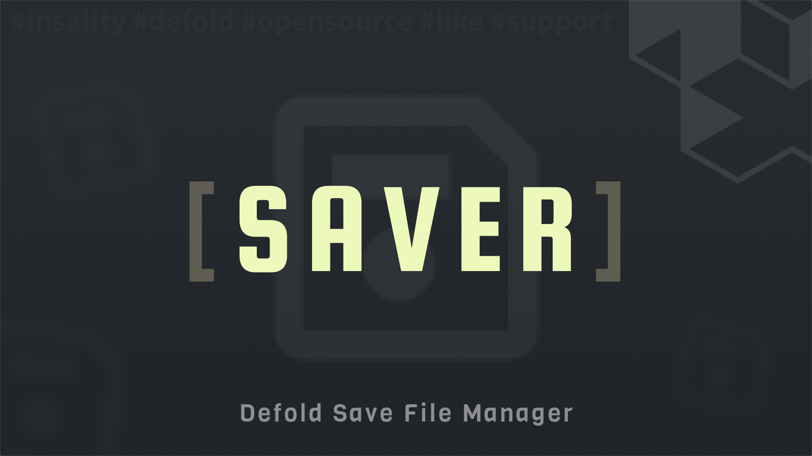

[](https://github.com/Insality/defold-saver/tags)
[](https://github.com/Insality/defold-saver/actions)
[](https://codecov.io/gh/Insality/defold-saver)

[](https://github.com/sponsors/insality) [](https://ko-fi.com/insality) [](https://www.buymeacoffee.com/insality)

# Saver

**Saver** - is a library for saving and loading save data in **Defold** projects. It provides a simple API for saving and loading save data, as well as support for migrations and simple key-value storage. The library supports saving and loading data in JSON, Lua, or binary format, and can save and load files to and from the file system.

## Features

- **Save and Load Game State**: Save and load data with a simple API.
- **File Management**: Save and load data to and from files.
- **Auto-Save**: Automatically save data at regular intervals.
- **Migrations**: Apply migrations to data when the migration version changed.
- **Storage**: Store key-value pairs in the save data.
- **Format support**: Save and load data in JSON, Lua or binary format.
- **Binary Data**: Save and load both Lua tables and raw binary data (like images) with dedicated API.

## Setup

### [Dependency](https://www.defold.com/manuals/libraries/)

Open your `game.project` file and add the following line to the dependencies field under the project section:

**[Saver](https://github.com/Insality/defold-saver/archive/refs/tags/3.zip)**

```
https://github.com/Insality/defold-saver/archive/refs/tags/3.zip
```

After that, select `Project ▸ Fetch Libraries` to update [library dependencies]((https://defold.com/manuals/libraries/#setting-up-library-dependencies)). This happens automatically whenever you open a project so you will only need to do this if the dependencies change without re-opening the project.

### Library Size

> **Note:** The library size is calculated based on the build report per platform

| Platform         | Library Size |
| ---------------- | ------------ |
| HTML5            | **5.23 KB**  |
| Desktop / Mobile | **8.68 KB**  |


### Configuration [optional]

You should configure the module in the `game.project` file:

```ini
[saver]
save_name = game
save_folder = Defold Saver
autosave_timer = 3
saver_key = saver
storage_key = storage
lua_require_as_string = 0
```

This configuration section for `game.project` defines various settings:

- **save_name**: The name of the save file. Default is `game`. The file will be stored in the `save_folder` folder. The file extension can be: `.json`, `.lua`, if not specified, the `sys.save` and `sys.load` function will be used to save the data in binary format. Recommended to use binary format (no file extension).
- **save_folder**: The folder name where the save file will be stored. Default is your `project.title` name (with only alphanumeric, underscores or spaces characters).
- **autosave_timer**: The time interval in seconds between auto-saves. Default is `3`.
- **saver_key**: The key in the save data table that contains the Saver state. Default is `saver`.
- **storage_key**: The key in the save data table that contains the Storage state. Default is `storage`.
- **lua_require_as_string**: If set to `1`, the `require()` function will load Lua files as strings instead of Lua tables. This is useful for loading external files and processing their paths. The default value is `0`. This setting only affects the Lua format and works for both save and load functions.

### Core Concepts

Defold Saver uses the following core concepts:
- **Auto-Save**: Automatically save data at regular intervals. It used as a default save method. This allows you to specify the data you want to keep in the save file and the library will handle the rest.
- **Save State**: A Save state contains a set of table references in the save file. You can bind multiple save states. Bindings is done by the `saver.bind_save_state(id, table_reference)` function. When you bind the table to save state and previous data was saved, the save data will override values in your reference table. So usually you should bind the default table from module or your game data on game loader step.
- **Migration**: Migrations are used to update the save data if required. Migration is a just list of functions that will be applied to the save data if the migration version in save is less than the migrations count. You can set migrations by `saver.set_migrations` function before `saver.init` and apply them by `saver.apply_migrations` function after.
- **Storage**: Storage is a simple key-value storage that can be utilized in many ways and you don't want to make a separate save state for it. You can set and get values by `storage.set` and `storage.get` functions.
- **Saving Userdata**: Take a note, if your data contains Defold userdata, like `vmath.vector3`, `hash` etc, you should don't use the `json` file format, due the userdata will be lost. Use `lua` or `binary` format instead. Read more in Use Cases section.
- **Binary Data Handling**: The library provides dedicated functions for handling binary data (like images or other non-Lua tables) and Lua tables that contain Defold userdata. Use `saver.save_binary_data`/`saver.load_binary_data` for raw binary data and `saver.save_file_by_name`/`saver.load_file_by_name` with `saver.FORMAT.BINARY` for Lua tables with userdata.


## Basic Usage

```lua
local saver = require("saver.saver")

local game_data = {
	score = 0,
	level = 1,
}

function init(self)
	saver.init()
	saver.bind_save_state("game", game_data)

	-- Now we can change game_data content and it will be saved automatically via autosave
	game_data.score = game_data.score + 1

	-- Or you can save it manually by saver.save_game_state() if you want to save it immediately
	saver.save_game_state()
end
```


## API Reference

### Quick API Reference

```lua
local saver = require("saver.saver")

-- Main
saver.init()
saver.bind_save_state(table_key_id, table_reference)
saver.save_game_state([save_name])
saver.load_game_state([save_name])
saver.set_game_state(game_state)
saver.get_game_state()
saver.delete_game_state([save_name])

-- File
saver.save_file_by_path(data, absolute_file_path, [format])
saver.load_file_by_path(absolute_file_path, [format])
saver.delete_file_by_path(absolute_file_path)
saver.save_file_by_name(data, file_name, [format])
saver.load_file_by_name(file_name, [format])
saver.delete_file_by_name(file_name)
saver.save_binary_by_path(data, filename)
saver.load_binary_by_path(filename)

-- Storage
saver.set_value(key_id, value)
saver.get_value(key_id, [default_value])

-- Other
saver.set_autosave_timer(seconds)
saver.get_save_path(file_name)
saver.get_save_version()
saver.set_migrations(migration_list)
saver.apply_migrations()
saver.set_logger(logger)
saver.get_current_game_project_folder()
saver.before_save_callback = function() "Called before saver saves data" end


-- File format constants
saver.FORMAT.JSON
saver.FORMAT.LUA
saver.FORMAT.BINARY
saver.FORMAT.SERIALIZED

local storage = require("saver.storage")
storage.set(id, value)
storage.get(id, [default_value])
storage.get_number(id, [default_value])
storage.get_string(id, [default_value])
storage.get_boolean(id, [default_value])
storage.get_table(id, [default_value])
storage.is_exists(id)
storage.delete(id)
```

### API Reference

Read the [API Reference](API_REFERENCE.md) file to see the full API documentation for the module.


## Use Cases

Read the [Use Cases](USE_CASES.md) file to see several examples of how to use the this module in your Defold game development projects.


## License

This project is licensed under the MIT License - see the [LICENSE](LICENSE) file for details.


## Issues and Suggestions

For any issues, questions, or suggestions, please [create an issue](https://github.com/Insality/defold-saver/issues).


## 👏 Contributors

<a href="https://github.com/Insality/defold-saver/graphs/contributors">
  
</a>

## Changelog

<details>

### **V1**
- Initial release

### **V2**
- Update docs, missing API for saver.delete_* functions
- Fix error with `get_current_game_project_folder` while using in HTML5 builds
- Add `saver.before_save_callback` callback for custom save logic. Can be used to prepare/update data before saving, like transfing from real-time data to save data

### **V3**
- **BREAKING**: HTML5 data now using `sys.serialize` instead `json.encode` due the issue with `json.encode` (sparse arrays, number keys)
	- I'm not expecting any game in production to use this feature, but if you are using it, please implement migration for your save data
- **BREAKING**: Change the way to get the project file name. Now it's removing the spaces and special characters from the project title.
	- To get the previous behavior, you should set the `save_folder` in the `game.project` file.

- Add `saver.save_folder` configuration option to README.md.
- Fix `saver.delete_file_by_path` for HTML5.

### **V4**
- Improved binary data handling with explicit API for different file formats
- Added dedicated functions for handling binary data and tables with Defold userdata
- Better file format detection and improved internal implementation
- More consistent API for saving and loading files
</details>


## ❤️ Support project ❤️

Your donation helps me stay engaged in creating valuable projects for **Defold**. If you appreciate what I'm doing, please consider supporting me!

[](https://github.com/sponsors/insality) [](https://ko-fi.com/insality) [](https://www.buymeacoffee.com/insality)
